# NoSQL Course - Cassandra Practice Work 
Colin TANTER - ESILV - OCC3

[link to my github repository](https://github.com/colin03ttr/NoSQL-PracticeWork-Cassandra)
## Create Database on Cassandra

### Files transfer

```bash
docker cp .\DBLP.tar.gz cassandraServer:/
```
```
Successfully copied 4.84MB to cassandraServer:/
```

On Docker Desktop, I open the CLI and extract the compressed data :

```
# ls
bin  boot  __cacert_entrypoint.sh  DBLP.tar.gz  dev  etc  home  lib  lib32  lib64  libx32  media  mnt  opt  proc  root  run  sbin  srv  sys  tmp  usr  var
# tar xzvf DBLP.tar.gz
DBLP/
DBLP/._.DS_Store
DBLP/.DS_Store
DBLP/._authors_publis.csv
DBLP/authors_publis.csv
DBLP/._authors.csv
DBLP/authors.csv
DBLP/._liste.csv
DBLP/liste.csv
DBLP/._DBLP_publis.csv
DBLP/DBLP_publis.csv
DBLP/DBLP.json
# ls     
bin  boot  __cacert_entrypoint.sh  DBLP  DBLP.tar.gz  dev  etc  home  lib  lib32  lib64  libx32  media  mnt  opt  proc  root  run  sbin  srv  sys  tmp  usr  var
```
Using the cqlsh command, I can start making queries to create a database and import the data.
```
# cqlsh
Connected to Test Cluster at 127.0.0.1:9042
[cqlsh 6.2.0 | Cassandra 5.0.2 | CQL spec 3.4.7 | Native protocol v5]
Use HELP for help.
cqlsh> CREATE KEYSPACE IF NOT EXISTS DBLP
   ... WITH REPLICATION =
   ... { 'class' : 'SimpleStrategy', 'replication_factor': 3 };

Warnings :
Your replication factor 3 for keyspace dblp is higher than the number of nodes 1

cqlsh> USE DBLP;
```
I created a database called `DBLP`, now lets create the table `publications`, and an index for the publication `type`:
```
cqlsh:dblp> CREATE TABLE publications (
        ... art_id TEXT, type TEXT, title text, pages_start INT, pages_end int, booktitle text,
        ... journal_series text, journal_editor text, journal_volume int, journal_isbn text,
        ... url text, year int,
        ... PRIMARY KEY (art_id)
        ... );
cqlsh:dblp> ALTER TABLE publications WITH GC_GRACE_SECONDS = 0;
cqlsh:dblp> CREATE INDEX btree_publi_type on publications(type);
```
And now lets import the data from the file `DBLP_publis.csv` :
```
cqlsh:dblp> COPY publications(art_id,type,year,title,pages_start,pages_end,booktitle,journal_series,
        ... journal_editor,journal_volume,journal_isbn,url)
        ... FROM 'DBLP/DBLP_publis.csv' WITH HEADER = true AND DELIMITER=';';
Using 7 child processes

Starting copy of dblp.publications with columns [art_id, type, year, title, pages_start, pages_end, booktitle, journal_series, journal_editor, journal_volume, journal_isbn, url].
Processed: 19693 rows; Rate:   12584 rows/s; Avg. rate:    7322 rows/s
19693 rows imported from 1 files in 0 day, 0 hour, 0 minute, and 2.690 seconds (0 skipped).
cqlsh:dblp> 
```

Let's do the same for the table `authors`, with 1 index on the `art_id` and 1 index on the `pos` :
```
cqlsh:dblp> CREATE TABLE authors (
        ... art_id TEXT, author TEXT, pos INT,
        ... PRIMARY KEY ((author), art_id)
        ... );
cqlsh:dblp> ALTER TABLE authors WITH GC_GRACE_SECONDS = 0;
cqlsh:dblp> CREATE INDEX btree_authors_art_id on authors(art_id);
cqlsh:dblp> CREATE INDEX btree_authors_pos on authors(pos);
cqlsh:dblp> COPY authors(art_id,author,pos) FROM 'DBLP/authors.csv' WITH HEADER = true AND DELIMITER=';';
Using 7 child processes

Starting copy of dblp.authors with columns [art_id, author, pos].
Processed: 50590 rows; Rate:   14771 rows/s; Avg. rate:   20546 rows/s
50590 rows imported from 1 files in 0 day, 0 hour, 0 minute, and 2.462 seconds (0 skipped).
cqlsh:dblp> 
```
Same for the `authors_publis` table :
```
cqlsh:dblp> CREATE TABLE authors_publis (
        ... art_id TEXT, author TEXT, type TEXT, title text, pages_start INT, pages_end int,
        ... booktitle text, journal_series text, journal_editor text, journal_volume int,
        ... journal_isbn text, url text, year int, pos int,
        ... PRIMARY KEY ((author), art_id)
        ... );
cqlsh:dblp> ALTER TABLE authors_publis WITH GC_GRACE_SECONDS = 0;
cqlsh:dblp> CREATE INDEX btree_authors_publi_type on authors_publis(type);
cqlsh:dblp> CREATE INDEX btree_authors_publi_title on authors_publis(title);
cqlsh:dblp> COPY authors_publis(art_id,author,type,year,title,pages_start,pages_end,booktitle,
        ... journal_series,journal_editor,journal_volume,journal_isbn,url,pos)
        ... FROM 'DBLP/authors_publis.csv' WITH HEADER = true AND DELIMITER=';';
```
But the `COPY` didn't work and we got this response :
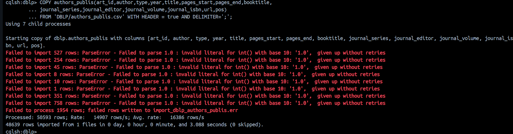

The response says the errors comes from the conversion of certain values '1.0' to integer.
But rows still got imported, so lets clear the table inserts and clean the csv file on our local environment.
```
cqlsh:dblp> TRUNCATE authors_publis;
cqlsh:dblp> SELECT * FROM authors_publis LIMIT 6;

 author | art_id | booktitle | journal_editor | journal_isbn | journal_series | journal_volume | pages_end | pages_start | pos | title | type | url | year
--------+--------+-----------+----------------+--------------+----------------+----------------+-----------+-------------+-----+-------+------+-----+------

(0 rows)
cqlsh:dblp>
```
We deleted all rows from authors_publis, lets copy the `authors_publis.csv` file outside the container (from the PowerShell bash) :
```bash
docker cp cassandraServer:/DBLP/authors_publis.csv .
```
```
Successfully copied 9.72MB to C:\.......\NoSQL\NoSQL-PracticeWork-Cassandra\.
```

I wrote a [python script](./cleanup.py) that cleans the csv file by converting the `1.0` values into actual integers and write the result in a new file `authors_publis_cleaned.csv`.

I can then copy this cleaned file back into the container's **DBLP** folder :
```bash
docker cp .\authors_publis_cleaned.csv cassandraServer:/DBLP
```
```
Successfully copied 9.78MB to cassandraServer:/DBLP
```

We can then try the `COPY` command again :

```
cqlsh:dblp> COPY authors_publis(art_id,author,type,year,title,pages_start,pages_end,booktitle,
        ... journal_series,journal_editor,journal_volume,journal_isbn,url,pos)
        ... FROM '/DBLP/authors_publis_cleaned.csv' WITH HEADER = true AND DELIMITER=';';
Using 7 child processes

Starting copy of dblp.authors_publis with columns [art_id, author, type, year, title, pages_start, pages_end, booktitle, journal_series, journal_editor, journal_volume, journal_isbn, url, pos].
Processed: 50593 rows; Rate:   15298 rows/s; Avg. rate:   14393 rows/s
50593 rows imported from 1 files in 0 day, 0 hour, 0 minute, and 3.515 seconds (0 skipped).
cqlsh:dblp> 
```
And now it worked fine.

## Query Cassandra 

We succesfully created the database and imported the data from the datasets, so we can now execute queries using `Tableplus`

### Simple Queries

```sql
USE DBLP;
```
```sql
SELECT * FROM publications;
```
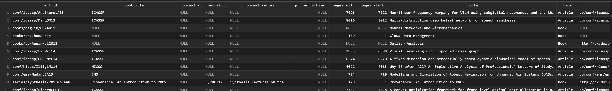 19693 rows output.
```sql
SELECT title FROM publications;
```
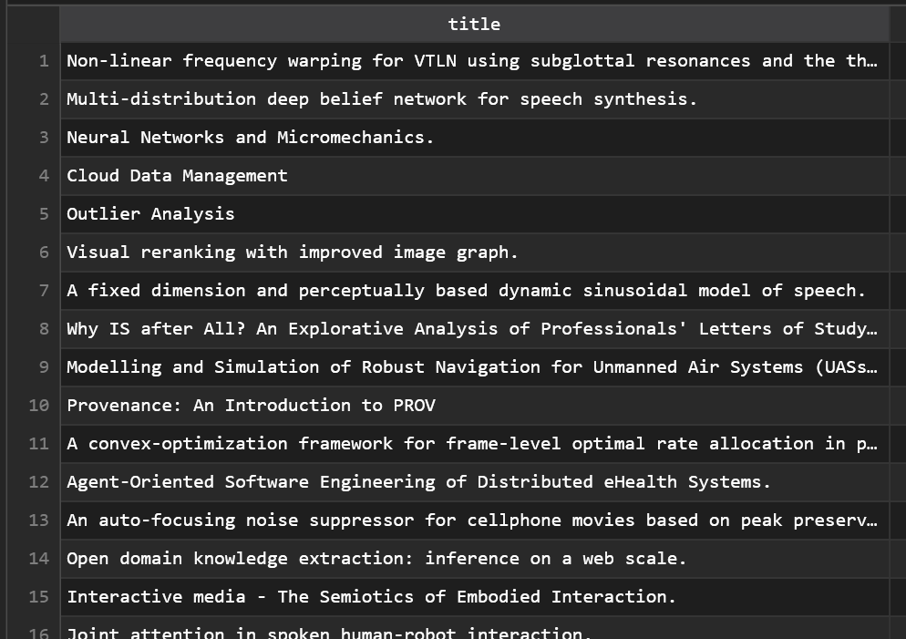 19693 rows output.
```sql
SELECT booktitle FROM publications WHERE art_id='series/sci/2008-156';
```
 1 row output.

```sql
SELECT COUNT(*) FROM publications WHERE type = 'Book';
```
 1 row output.

```sql
SELECT COUNT(*) FROM publications WHERE booktitle = 'HICSS' ALLOW FILTERING;
```
 1 row input.

```sql
CREATE INDEX IF NOT EXISTS idx_booktitle ON publications(booktitle);
SELECT COUNT(*) FROM publications WHERE booktitle = 'HICSS';
```
 Without the need of `ALLOW FILTERING`.

```sql
SELECT COUNT(*) FROM publications WHERE type = 'Article' AND booktitle = 'HICSS' ALLOW FILTERING;
```
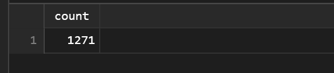

```sql
SELECT COUNT(*) FROM authors WHERE pos = 3;
```


```sql
SELECT COUNT(*) FROM authors WHERE pos > 3 ALLOW FILTERING;
```
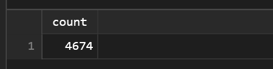

```sql
SELECT COUNT(*) FROM publications WHERE token(art_id) < 0;
```
 
```sql
SELECT art_id, token(art_id) FROM publications;
```
 19 693 rows output.

### Complex Queries: Aggregates

**1. Count the number of publications per author**
```sql
SELECT author, count(*) FROM authors GROUP BY author;
```
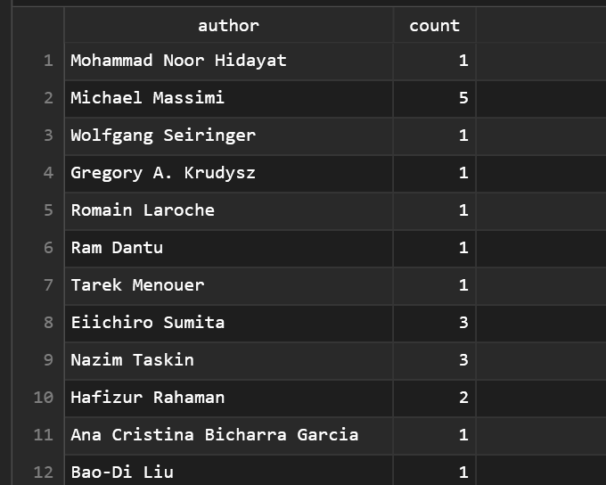
36 653 rows output.

**2. Count the number of publications per author when they are in third position**
```sql
SELECT author, count(*) FROM authors WHERE pos=2 group by author;
```
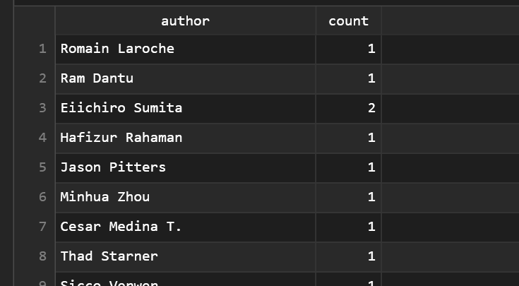 7420 rows output.

**3. Try to count the number of authors per position.**
Hint: Choose an other partitioning key.

We need to create a different table to let 'pos' be the partitioning key.
```sql
CREATE TABLE authors_pos (
        art_id TEXT, 
        author TEXT, 
        pos INT,
        PRIMARY KEY ((pos), art_id)
);
ALTER TABLE authors_pos WITH GC_GRACE_SECONDS = 0;
CREATE INDEX btree_authorsPos_art_id on authors_pos(art_id);
CREATE INDEX btree_authorsPos_authors on authors_pos(author); 
```
lets import the data into it :
```sql
COPY authors_pos(art_id,author,pos) FROM '/DBLP/authors.csv'
WITH HEADER = true AND DELIMITER=';';
```
```
Using 16 child processes

Starting copy of dblp.authors_pos with columns [art_id, author, pos].
Processed: 50590 rows; Rate:   38195 rows/s; Avg. rate:   68604 rows/s
50590 rows imported from 1 files in 0.738 seconds (0 skipped).
```
And we can now perform the query on `authors_pos`.
```sql
SELECT pos, count(*) FROM authors_pos GROUP BY pos;
```
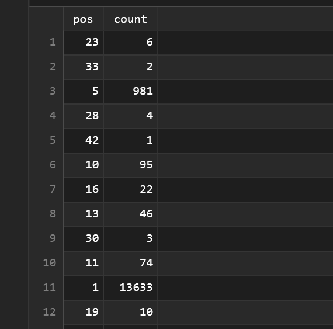 47 rows output.

**4. Distribution of positions for author *Oscar Castillo***

We can use the same table we created earlier to **GROUP BY** `pos` :
```sql
SELECT pos, count(*) FROM authors_pos WHERE author='Oscar Castillo' GROUP BY pos;
```
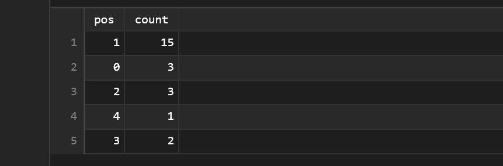 5 rows ooutput.

### Complex Queries: Joins & Denormalization

**1. Give authors’ name for publication which title is “Medical imaging archiving: A comparison between several NoSQL solutions.”. Join between tables publications and authors**

Firstly, we try to perform the join between the 2 tables `authors` and `publications`.
```sql
SELECT author 
FROM authors 
JOIN publications ON authors.art_id = publications.art_id 
WHERE publications.title = 'Medical imaging archiving: A comparison between several NoSQL solutions.';
```
But the database rejects the `JOIN` because it is a distributed database.

**2. There is no way to do a join in CQL¹. A first denormalization step has been done on this dataset with table “authors_publis”. Try the previous query on this denormalized table.**

So we perform a simple query on the denormalized table that joins `authors` and `publications` : 
```sql
SELECT author FROM authors_publis WHERE title='Medical imaging archiving: A comparison between several NoSQL solutions.';
```
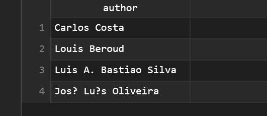 4 rows output.

**3. Give titles and position of publications from “Oscar Castillo”**

```sql
SELECT pos, title FROM authors_publis WHERE author='Oscar Castillo';
```
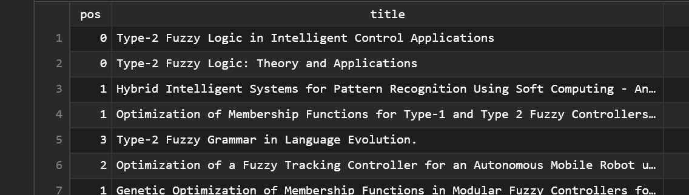 24 rows output.

**4. Give authors’ name who published with “Oscar Castillo”**

Since we can't perform joins and subqueries, we can't get this in only one query.

I tried materialized views on the coauthors, but they are disabled as well.

**5. To answer this query, it requires a new denormalization with SET, MAP, LIST, TYPES or TUPLE. Create a table “publicationsNorm’’ which can insert documents in file “DBLP.json”.**

Let's create the table for denormalization, for this, the journal has a few parameters so we can create a custom type for the journal :
```sql
CREATE TYPE IF NOT EXISTS journalType (
        series TEXT, 
        editor TEXT, 
        volume INT, isbn 
        SET<TEXT>
);
```
Now the table using the type *journalType* for `journal` :
```sql
CREATE TABLE publicationsNorm (
    id TEXT PRIMARY KEY,
    type TEXT,
    year INT,
    title TEXT,
    authors LIST<TEXT>,
    pages MAP<TEXT, INT>,
    booktitle TEXT,
    journal frozen<journalType>,
    url TEXT,
    cites SET<TEXT>
);
```

**6. Once this sample can be inserted, import the whole dataset with this command (in the Docker CLI environment)**

```
SOURCE '/DBLP/DBLP.json';
```
But this query were taking forever with no output, so I had to dig into it :

- I tried to execute it directly from TablePlus and found an error at line 344 : missing both the closing quote and semi-comma :
```sql
INSERT INTO publicationsNorm JSON '{
    "id":"series/star/12-76",
    "type":"Book", 
    "title":"Towards Service Robots for Everyday Environments - Recent Advances in Designing Service Robots for Complex Tasks in Everyday Environments", 
    "authors":[  ], 
    "pages":{"start":0, "end":0}, 
    "booktitle":null, 
    "journal":{"series":"", "editor":"", "volume":"", "isbn":[  ]}, 
    "url":null, 
    "cites":[  ], 
    "year":2011}
```
so I edited the file adding `';`

Then I deleted all rows :
```sql
TRUNCATE publicationsNorm;
```
Added the sample data :
```sql
INSERT INTO publicationsNorm JSON
'{"id":"series/cogtech/BrandhermSNL13", "type":"Article", "year":2013,
"title":"A SemProM Use Case: Health Care and Compliance.",
"authors":["Boris Brandherm","Michael Schmitz","Robert Ne?elrath","Frank Lehmann"],
"pages":{"start":349, "end":361}, "booktitle":"SemProM",
"journal":{"series":"", "editor":"", "volume":0, "isbn":[ "" ]},
"url":"db/series/cogtech/364237376.html#BrandhermSNL13", "cites":[ "" ]}';
```
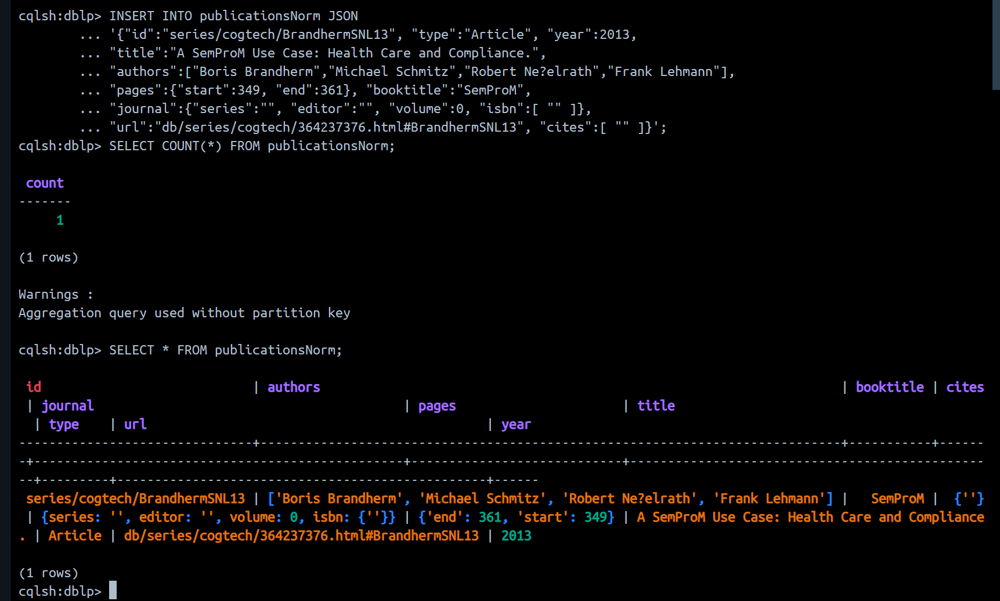

I now run the previous command to insert the whole dataset :
```sql
SOURCE '/DBLP/DBLP.json';
```
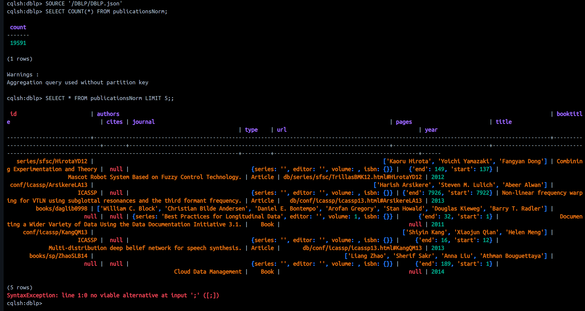 and it worked perfectly fine and fast.

**7. Create an index on attribute ’title’ of this new table**

```sql
CREATE INDEX IF NOT EXISTS publicationsNorm_title ON publicationsNorm(title);
```

**8. Give authors’ name for publication “Data Quality” in this new table**

```sql
SELECT authors FROM publicationsNorm WHERE title='Data Quality';
```
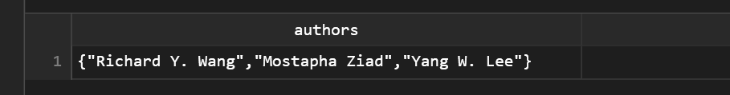 1 row output.

**9. Give the journal’s series of this publication**

```sql
SELECT journal.series FROM publicationsNorm WHERE title='Data Quality';
```
 1 row output.


### Hard Queries: User Define Aggregate functions

 **1. Enable user_define_function**
```bash
apt-get update 
```
```
apt-get install vim
```
```
vim /etc/cassandra/cassandra.yaml
```
then I found the `user_defined_functions_enabled` variable and changed it to `true` using the `/` to search.
Then I saved an quit the vim editor. 

After restarting the container, we can create functions.

 **2. Create your Own Function**


State function :
```sql
CREATE OR REPLACE FUNCTION avgState ( state tuple<int,bigint>, val int )
CALLED ON NULL INPUT RETURNS tuple<int,bigint> LANGUAGE java
AS 'if (val !=null) { state.setInt(0, state.getInt(0)+1); state.setLong(1, state.getLong(1)+val.intValue()); } return state;';
```
 
Final Function :
```sql
CREATE OR REPLACE FUNCTION avgFinal ( state tuple<int,bigint> )
CALLED ON NULL INPUT RETURNS double LANGUAGE java
AS 'double r = 0; if (state.getInt(0) == 0) return null; r = state.getLong(1); r/= state.getInt(0); return Double.valueOf(r);';
```

UDA function :
```sql
CREATE AGGREGATE IF NOT EXISTS average ( int )
SFUNC avgState STYPE tuple<int,bigint>
FINALFUNC avgFinal INITCOND (0,0);
```

Compute the average position of “Oscar Castillo” in his publications
```sql
SELECT average(pos) FROM authors_publis WHERE author = 'Oscar Castillo';
```
 1 row output.

Idem with the average number of pages

We need to create a function minus to calculate the total of pages, since we only have `pages_start` and `pages_end` :
```sql
CREATE OR REPLACE FUNCTION minus(a INT, b INT)
RETURNS NULL ON NULL INPUT RETURNS INT LANGUAGE Java AS
'return a - b;';
```
```sql
SELECT average(minus(pages_end,pages_start)) FROM authors_publis WHERE author='Oscar Castillo';
```
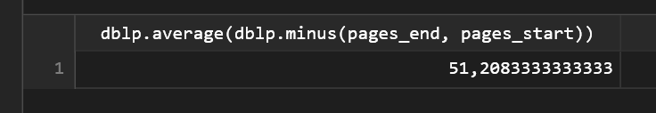 1 row output.


Bonus: Create a new UDA to produce an equivalence to ”GROUP BY + COUNT” on textual attributes, like for :
```sql
SELECT countGroup(pos) FROM authors_publis;
```
The type of the “state” parameter must be a “MAP<int, int>”.

```sql
CREATE OR REPLACE FUNCTION countGroupState ( state map<int, int>, val1 int)
CALLED ON NULL INPUT RETURNS map<int, int> LANGUAGE java AS
'if(val1 == null) return state; Integer count = (Integer)state.get(val1); if(count == null) count = 0; count ++; state.put(val1, count); return state;';
```
```sql
CREATE OR REPLACE AGGREGATE countGroup (int)
SFUNC countGroupState STYPE map<int, int>
INITCOND {};
```
now lets run the query :
```sql
SELECT countGroup(pos) FROM authors_publis;
```
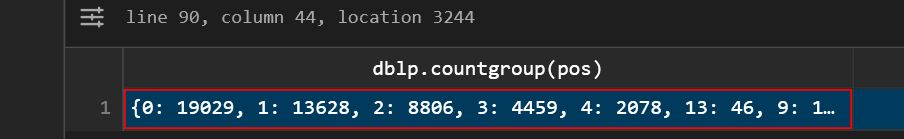 1 row output.

here is the complete group :
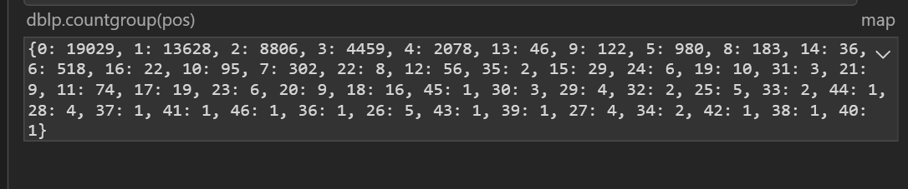
