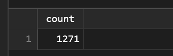
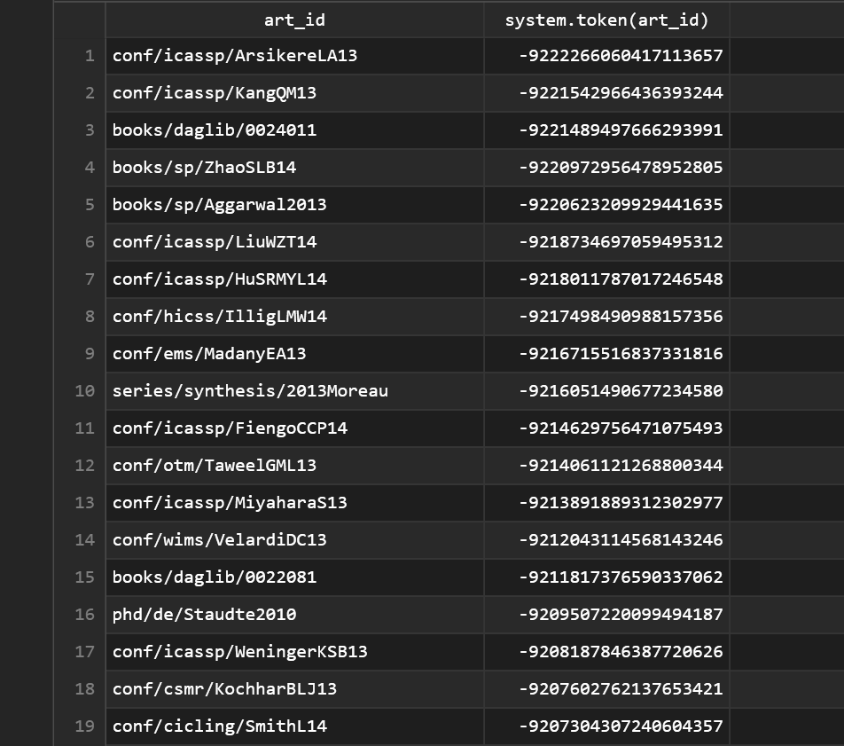

# NoSQL Course - Cassandra Practice Work 


COPY authors_publis(art_id,author,type,year,title,pages_start,pages_end,booktitle,
journal_series,journal_editor,journal_volume,journal_isbn,url,pos)
FROM './authors_publis_cleaned.csv' WITH HEADER = true AND DELIMITER=';';

```sql
USE DBLP;
```
```sql
SELECT * FROM publications;
```
 19693 rows output.
```sql
SELECT title FROM publications;
```
 19693 rows output.
```sql
SELECT booktitle FROM publications WHERE art_id='series/sci/2008-156';
```
 1 row output.

```sql
SELECT COUNT(*) FROM publications WHERE type = 'Book';
```
 1 row output.

```sql
SELECT COUNT(*) FROM publications WHERE booktitle = 'HICSS' ALLOW FILTERING;
```
 1 row input.

```sql
CREATE INDEX IF NOT EXISTS idx_booktitle ON publications(booktitle);
SELECT COUNT(*) FROM publications WHERE booktitle = 'HICSS';
```
 Without the need of `ALLOW FILTERING`.

```sql
SELECT COUNT(*) FROM publications WHERE type = 'Article' AND booktitle = 'HICSS' ALLOW FILTERING;
```


```sql
SELECT COUNT(*) FROM authors WHERE pos = 3;
```


```sql
SELECT COUNT(*) FROM authors WHERE pos > 3 ALLOW FILTERING;
```


```sql
SELECT COUNT(*) FROM publications WHERE token(art_id) < 0;
```
 
```sql
SELECT art_id, token(art_id) FROM publications;
```
 19 693 rows output.